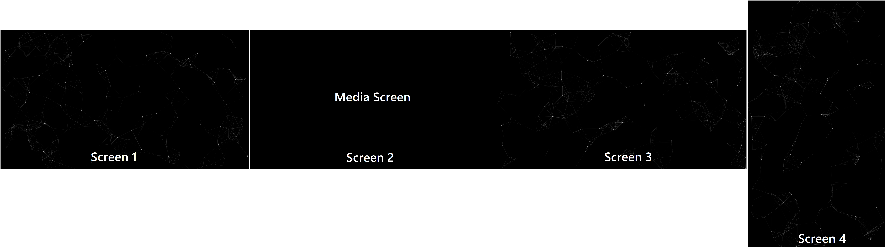

# hidewindow

A simple cross-platform application built using [electron](https://electronjs.org/) to hide other application windows behind it.
The application window will always appear on top of other windows.

The application was developed to blackout other displays while watching movies on the main display.

Above is an example of three instances of hidewindow in full screen mode on three displays.

Usage:
drag edges to scale the window to your heart's delight
double-click window to maxmize it
the 's' key toggles the particle animation
the 'w' key toggles between black and white background colors
'F11' key allows you to go into full-screen mode
